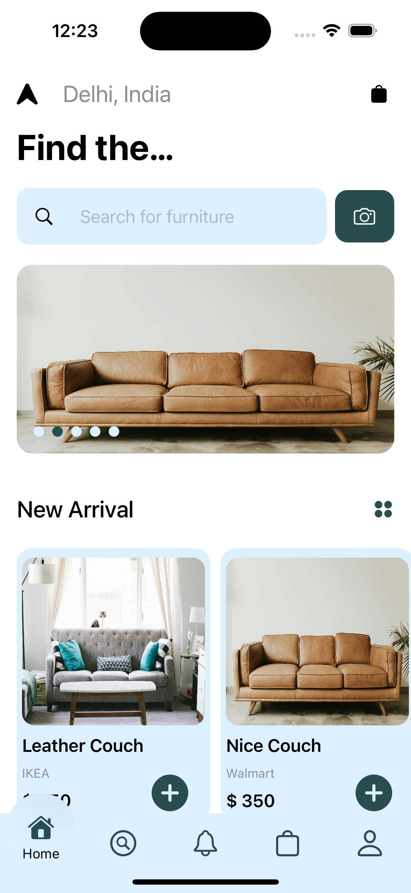
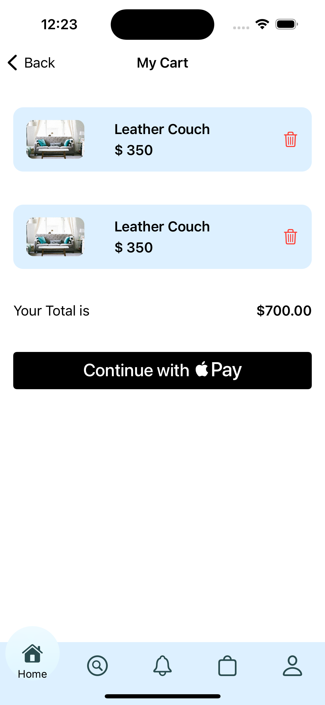
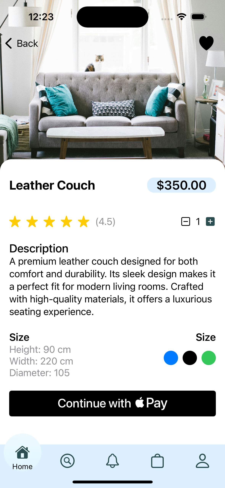
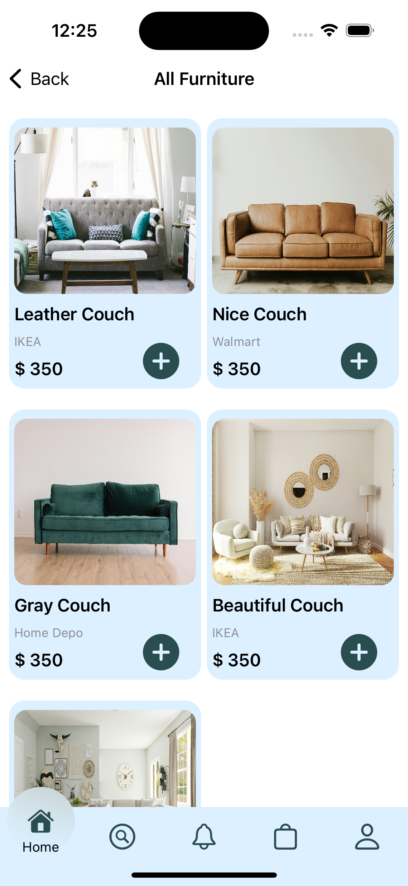

🛋️ Furniture Swift
===================

A modern **Furniture E-Commerce App** built with **SwiftUI** using the **MVC (Model--View--Controller)** architecture.\
This project demonstrates product listing, cart management, a custom tab bar, auto image slider, and Apple Pay button integration.

* * * * *

📸 Screenshots
--------------

<table>
  <tr>
    <td align="center">
      <b>🏠 Home Page</b> 
      
    </td>
    <td align="center">
      <b>🛒 Cart Page</b> 
      
    </td>
    <td align="center">
      <b>📖 Product Detail</b> 
      
    </td>
    <td align="center">
      <b>🛍️ All Product</b> 
      
    </td>
  </tr>
</table>

✨ Features
----------

-   🏠 **Home Page** with product listing and dynamic sections.

-   🎞️ **Auto Image Slider** (5-second interval).

-   🆕 **New Arrivals Section** for trending products.

-   📖 **Product Detail Page** with description, ratings, and size/color options.

-   🛒 **Cart Management** (Add/Remove products, dynamic total).

-   🍎 **Apple Pay Button** (UI implemented, ready for integration).

-   📱 **Custom TabBar** with smooth animation.

-   🧩 **MVC Architecture** for scalability.

-   🎨 Modern **SwiftUI design** with reusable components.

* * * * *

🛠️ Tech Stack
--------------

-   **Language**: Swift

-   **Framework**: SwiftUI

-   **Architecture**: MVC (Model--View--Controller)

-   **Payment**: PassKit / Apple Pay (button ready)

* * * * *

📂 Project Structure
--------------------

`Furniture-Swift/
│
├── Models/              # Product, Cart models
├── Views/               # SwiftUI screens (Home, Cart, Product Detail, etc.)
├── Components/          # Custom TabBar, Image Slider, Payment Button
├── Controllers/         # CartManager, Data handlers
├── Resources/           # Assets, Colors, Images
└── SupportingFiles/     # App entry point, configurations`

* * * * *

🚀 Getting Started
------------------

### 1️⃣ Clone the repository

`git clone https://github.com/13virat/Ecommerce.git
cd Ecommerce`

### 2️⃣ Open in Xcode

-   Open `Ecommerce.xcodeproj` in Xcode.

### 3️⃣ Run the project

-   Select a simulator or device.

-   Press **Cmd + R** to run.

* * * * *

💳 Apple Pay Button
-------------------

-   A **custom Apple Pay button** is already implemented using `PKPaymentButton`.

-   Currently, it **triggers an action callback** but does not process payments.

-   To fully integrate Apple Pay:

    -   Add a **Merchant ID** in Xcode → Signing & Capabilities.

    -   Configure `PKPaymentRequest` with merchant details.

    -   Handle transaction callbacks.

* * * * *

🔮 Future Improvements
----------------------

-   ✅ Backend API integration (for real products & payments).

-   ✅ Complete Apple Pay flow.

-   ✅ User authentication & order history.

-   ✅ Wishlist & Favorites.

-   ✅ Notifications for offers.

* * * * *

👨‍💻 Author
------------

Developed by **Virat Gupta** ✨

-   🎓 Final Year Engineering Student

-   🎨 UI/UX Designer & SwiftUI Developer

-   🌐 Django + React Enthusiast

* * * * *

📜 License
----------

This project is open-source and available under the MIT License.
